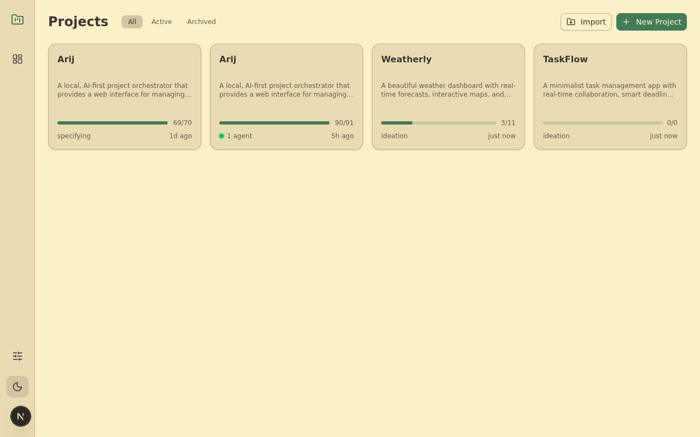
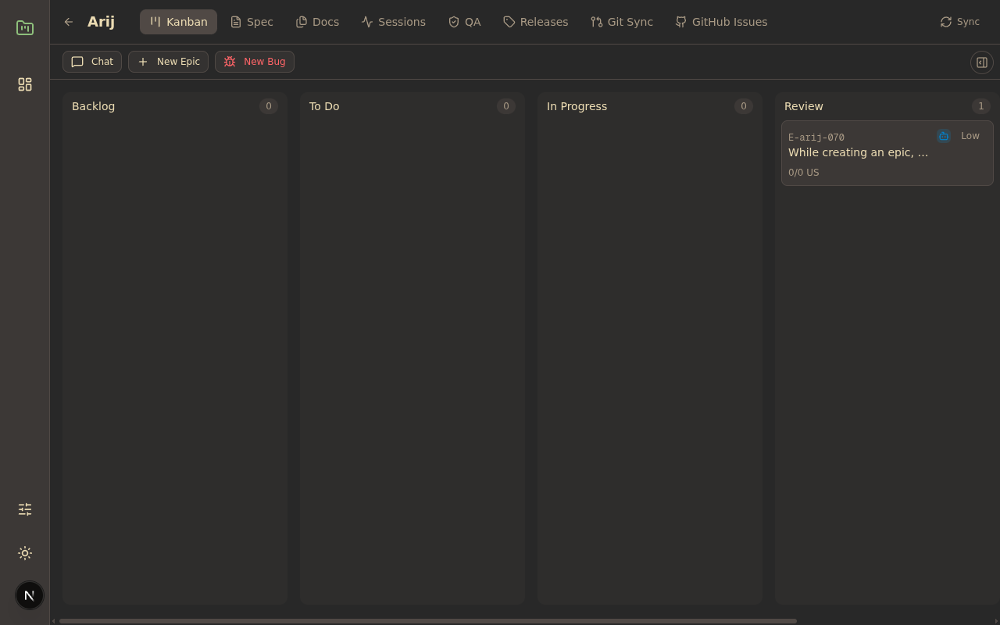

# Arij

**Your AI-powered project manager that actually writes the code.**

Arij is a local-first web app that lets you plan, organize, and build software projects using AI coding agents like Claude Code, OpenAI Codex, or Gemini CLI. Describe what you want, and Arij orchestrates the AI to implement it — managing git branches, worktrees, code reviews, and merges automatically.

Everything runs on your machine. No cloud. No account. No telemetry.



---

## Why Arij?

Most AI coding tools work at the file level — you prompt, you get code, you paste it in. Arij works at the **project level**:

- **You describe features as epics**, not individual prompts
- **AI agents build, review, and merge** code in isolated git worktrees
- **A Kanban board** tracks progress from backlog to done
- **Multiple AI providers** can work in parallel on different tasks
- **Everything is local** — your code never leaves your machine

---

## Features

### Project Dashboard
Manage multiple projects from a single overview. Each project card shows progress, current phase, and recent activity.


### Kanban Board
Organize your work into epics and bugs across workflow columns: Backlog, To Do, In Progress, Review, and Done. Drag and drop to reprioritize. Click any card to see details, comments, and agent activity.



### AI Chat Panel
Brainstorm ideas, create new epics, or refine your project spec — all through a chat interface powered by Claude Code (or another provider). The chat panel lives alongside the Kanban board in a resizable split view with tabbed conversations.

### One-Click Build
Select an epic and hit "Build". Arij will:
1. Create an isolated git worktree and branch
2. Compose a structured prompt from your spec, epic details, and project context
3. Spawn an AI agent to implement the feature
4. Track the session in real-time
5. Move the card to Review when done

### Multi-Provider Support
Use whichever AI coding tool you prefer:

| Provider | What it uses |
|----------|-------------|
| **Claude Code** | `claude` CLI — primary provider with plan + code modes |
| **OpenAI Codex** | `codex` CLI via Codex SDK |
| **Gemini CLI** | `gemini` CLI via Google |

Create "Named Agents" to mix and match providers and models — e.g., use Claude Opus for complex builds, Gemini Flash for quick bug fixes.

### Automated Code Review
After an agent builds a feature, trigger AI-powered reviews:
- **Security audit** — checks for vulnerabilities
- **Code review** — best practices and quality
- **Compliance check** — accessibility and standards

Review results are posted as comments on the epic.

### Agent Session Monitoring
Track every AI agent session with detailed status, duration, provider info, and logs. See what's running, what's completed, and what failed.


### Git Automation
Arij handles all the git plumbing:
- **Worktrees** — each epic gets its own isolated working directory
- **Branches** — automatic branch creation and naming
- **Push & PR** — push to remote and create pull requests from the UI
- **Merge** — merge completed work back to main

### Project Specification
Write and edit your project spec in Markdown. Use it as context for all AI interactions — the spec is automatically injected into agent prompts so the AI always understands your project.

### Document Upload
Upload reference documents (PDF, DOCX, Markdown, images) to your project. Documents are converted to Markdown and available as context for AI agents. Use `@filename` mentions in chat to reference specific docs.

### QA & Tech Checks
Run AI-powered quality audits on your entire project. Get a detailed report and create epics directly from the findings.

### Release Management
Create releases by selecting completed epics. Arij generates changelogs, creates git tags, and supports GitHub draft releases.

### Dependency Management
Set dependencies between epics. Arij builds a DAG and schedules agent work in the correct order — parallel where possible, sequential where required.

### Team Mode
For large features, enable Team Mode to have a single Claude Code session orchestrate multiple sub-agents working on different tickets simultaneously.

---

## Getting Started

### Prerequisites

- **Node.js** >= 20.9
- **Git** installed
- At least one AI coding CLI:
  - [Claude Code](https://docs.anthropic.com/en/docs/claude-code) — `npm install -g @anthropic-ai/claude-code`, then `claude auth`
  - [OpenAI Codex](https://github.com/openai/codex) — optional
  - [Gemini CLI](https://github.com/google-gemini/gemini-cli) — optional

### Install & Run

```bash
# Clone the repository
git clone https://github.com/yourorg/arij.git
cd arij

# Install dependencies
npm install

# Start the app
npm run dev
```

Open **http://localhost:3000** in your browser. The database is created automatically on first run.

### Your First Project

1. Click **"+ New Project"** on the dashboard
2. Give it a name, description, and point it to a local git repository
3. Write a project spec (or let the AI help you generate one via Chat)
4. Create epics by chatting with the AI — describe what you want and click "Create Epic & Generate Stories"
5. Drag epics to "To Do" and hit **Build** to start an agent

Or **Import** an existing codebase — Arij will analyze it and suggest epics automatically.

### Configuration

Create `.env.local` for optional settings:

```env
# GitHub integration (for push, PR creation, releases)
GITHUB_TOKEN=ghp_xxx

# Custom Claude CLI path
CLAUDE_PATH=/usr/local/bin/claude
```

Customize agent behavior through the **Agent Configuration** panel in the sidebar:
- **Prompts** — edit system prompts per agent type (build, review, chat, etc.)
- **Named Agents** — create provider+model combinations for different tasks
- **Provider Defaults** — set which agent handles each type of work

---

## How It Works

```
You describe a feature
        |
        v
  Arij creates an epic with user stories
        |
        v
  You click "Build"
        |
        v
  Arij creates a git worktree + branch
        |
        v
  AI agent implements the feature
        |
        v
  Card moves to "Review"
        |
        v
  You trigger AI code review
        |
        v
  You merge to main
```

All agent work happens in isolated git worktrees, so multiple features can be built in parallel without conflicts.

---

## Production Build

```bash
npm run build
npm run start
```

---

## Contributing

1. Fork the repository
2. Create a feature branch: `git checkout -b feat/my-feature`
3. Commit with conventional commits: `feat(scope): description`
4. Push and open a pull request

---

## License

[MIT](LICENSE)
